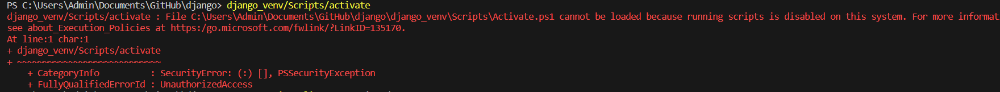

# django
A comprehensive training end to end on django.
# Installation
- 1. Open Power shell
- 2. <python> and press enter
- 3. if python install:
    1. pip install django
    
- 3. if python not install, install latest version first
    - 1. To install in same powercell write python and press enter
    - 2. Get it from microsoft store

