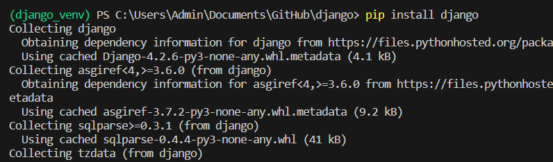

# Django Training Guide

A comprehensive end-to-end training guide on Django.

## Installation

Follow these steps to install Django:

1. Open PowerShell.

2. Type the following command and press Enter:

3. If Python is installed:

1. Install Django by running this command:
   ```
   pip install django
   ```
  

2. If Python is not installed, follow these steps:

   - To install Python in the same PowerShell, type:
     ```
     python
     ```
     and press Enter.

   - Alternatively, you can get Python from the Microsoft Store.

Now, your markdown document is more organized and easier to follow. If you have any more questions or need further assistance, feel free to ask!
